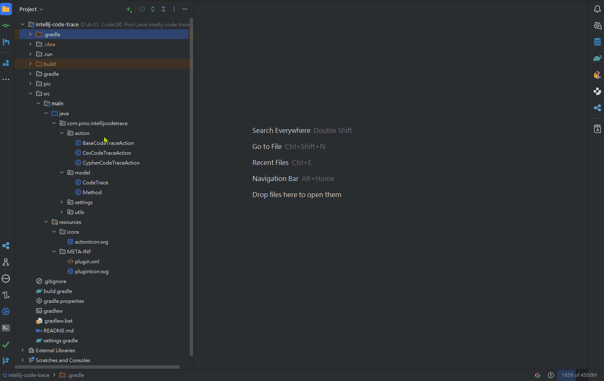
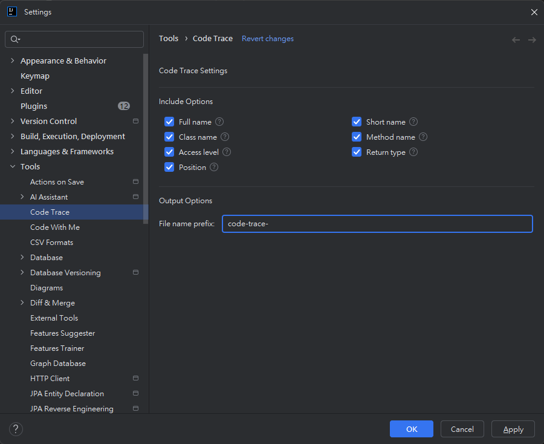

<div align="center">
    <a href="https://plugins.jetbrains.com/plugin/27772-code-trace">
        
    </a>
</div>

<h1 align="center">Intellij Code Trace</h1>

<p align="center">
<a href="https://plugins.jetbrains.com/plugin/27772-code-trace"></a>
<a href="https://plugins.jetbrains.com/plugin/27772-code-trace"></a>
<a href="https://plugins.jetbrains.com/plugin/27772-code-trace"></a>
</p>

<br>

> Jetbrains Marketplace: https://plugins.jetbrains.com/plugin/27772-code-trace

<b>Intellij Code Trace</b> is an IntelliJ IDEA plugin that analyzes your project’s source code and extracts method-to-method call relationships. 
It helps developers and architects better understand the structure and dependencies within their codebase.
<br>

<br>
(📝Note: Execution time may vary based on the number of selected files and the complexity of the project. Larger selections or more complex codebases may result in longer processing times.)


## Features
### 🔗 Analyze Method Call Relationships
Automatically detects and maps which methods call which, across your entire project.

### 📄 Export to CSV
Easily export analyzed data for further processing in Excel, scripts, or custom analysis tools.

### 🌐 Export to Cypher (Neo4j)
Generate Cypher queries to import method relationships into a Neo4j graph database for rich visual analysis and graph-based querying.

### ⚙️ Simple to Use
In the <b>Project View</b>, select the folder or file you want to analyze, right-click, and choose <b>"Export Code Trace"</b>. Then, select your preferred output format.

### 🛠️ Customizable
Under <b>Settings > Tools > Code Trace</b>, users can configure which data fields to include in the export, as well as define the output file name.

## Output Format Examples
The plugin supports exporting method relationships in two formats: CSV and Cypher.

### 📄 CSV Output
The CSV file contains information about caller and callee methods, making it easy to analyze dependencies in spreadsheet applications or custom scripts. <br/>
- Example:
    ```csv
    caller_short_name,caller_full_name,callee_short_name,callee_full_name
    "MethodUtils.getFullName","com.pino.intellijcodetrace.utils.MethodUtils.getFullName(Method)","Method.getClassQualifiedName","com.pino.intellijcodetrace.model.Method.getClassQualifiedName()"
    "MethodUtils.getShortName","com.pino.intellijcodetrace.utils.MethodUtils.getShortName(Method)","Method.getClassName","com.pino.intellijcodetrace.model.Method.getClassName()"
    ```

### 🌐 Cypher Output (Neo4j)
The Cypher output includes syntax to create relationships in Neo4j. <br/>
- Example:
    ```cypher
    MERGE (a:method {short_name: "MethodUtils.getFullName", full_name: "com.pino.intellijcodetrace.utils.MethodUtils.getFullName(Method)"}) MERGE (b:method {short_name: "Method.getClassQualifiedName", full_name: "com.pino.intellijcodetrace.model.Method.getClassQualifiedName()"}) MERGE (a)-[:call_method]->(b);
    MERGE (a:method {short_name: "MethodUtils.getShortName", full_name: "com.pino.intellijcodetrace.utils.MethodUtils.getShortName(Method)"}) MERGE (b:method {short_name: "Method.getClassName", full_name: "com.pino.intellijcodetrace.model.Method.getClassName()"}) MERGE (a)-[:call_method]->(b);
    ```

After importing into Neo4j, the method call relationships will appear as shown below: <br/>


## 🛠️ Settings

